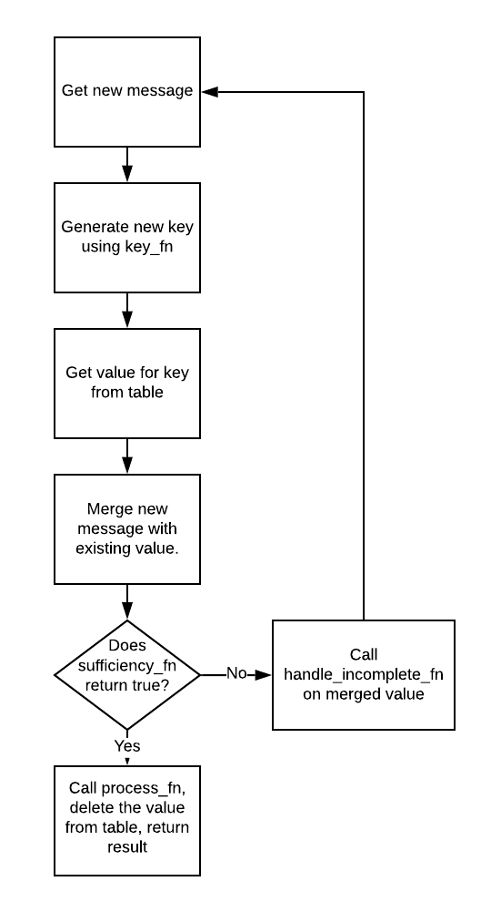

# Faust Joins

_A very small library for joining together fanned out messages in a Faust pipeline._

Sometimes it might be advantageous to have a pipeline split out and conduct multiple time-consuming operations in parallel, and then do something with all the results once all those operations are completed.

This library gives you a simple way to merge multiple streams back into a single stream in pretty arbitrary ways.

The core idea is to store related information using Faust Tables, merge in information as it comes in, and when a related set of information is deemed complete then to process it in some way. `make_joining_func` handles the logic of keeping track of the information, but the user must provide some functions for it to do so. In many cases these functions will be rather simple (i.e. `key_fn` will often be something like `lambda msg: msg.key`).



An example might make this more clear. Below is an annotated example (runnable in `/examples/suess_example.py`).


```
app = faust.App("suess", broker="kafka://localhost")

join_waitlist = app.Table("join_waitlist", partitions=1)

def things_both_there(suess_thing):
    """Check that the message has requisite elements."""
    # Figure out which things the test_message actually needs.
    return all([suess_thing.thing_one, suess_thing.thing_two])


def if_insufficient(suess_thing):
    """Placeholder function for incomplete things."""
    logging.info("INSUFFICIENT: " + str(suess_thing))


def do_things_to_the_thing(suess_thing):
    """To keep joiner logic separate from the suess logic just putting a stub here."""
    # Insert the messages into a DB here
    logging.info("Doing things with: " + str(suess_thing))

def merge_things(t1, t2):
    return TestMessageFormat(
        thing_id=t1.thing_id,
        thing_one=(t1.thing_one or t2.thing_one),
        thing_two=(t1.thing_two or t2.thing_two),
    )

class TestMessageFormat(faust.Record, serializer="json"):
    thing_id: uuid.UUID
    thing_one: Optional[str]
    thing_two: Optional[str]

"""
We pass the above functions into make_joining_func to give us a processor that handles incoming
messages from the Topic that our agent is listening to. If your process function returns a value
then you can get the result within the async for loop and do more things with the result if it
suits your needs.
"""

suess_processor = make_joining_func(
    tbl=join_waitlist,
    key_fn=(lambda r: r.thing_id),
    merge_fn=merge_things,
    sufficiency_fn=things_both_there,
    process_fn=do_things_to_the_thing,
    handle_incomplete_fn=if_insufficient,
)

suess_topic = app.topic("suess", value_type=TestMessageFormat)

@app.agent(suess_topic)
async def my_join(suess_things: AsyncIterable[TestMessageFormat]) -> None:
    """Joins messages from multiple contributing agents.

    Expects all fields to be non-None in the combined message (falsey values are fine,
    just not None).
    """
    async for suess_thing in suess_things:
        suess_processor(suess_thing)

```

**Tables for Joins**

Walking through this, we have a `Faust.Table` where we will store our intermediate values until all components are found (I've tried to make it so that other backends can be supported in the future, but right now only Table and Dict's are expected, and the latter only for testing). The Table cannot have a default value or it will break the joining logic, which is why the current implementation will raise an exception if there is any default value. If there is nothing in the table (as will be the case with the first element to be processed with a new result from `key_fn`) then value returned is the same as the value of the message being processed. So if the `tbl` is empty and we're ingesting `{id: 123, "foo": "bar", "baz": None}` and the key is `id`, then `tbl[123]` effectively returns `{id: 123, "foo": "bar", "baz": None}`.

**Getting Keys from Messages**

We have a `key_fn`, which in this case is very simple. It is the lambda function that calls `thing_id` on the message coming from the Topic. The result of this function called on a message should yield a hashable that can be used as a key on our Table.

More complicated key functions are also reasonable. Perhaps there is a composite key, or some object that should be hashed to determine whether or not multiple messages should be considered related.

**Merging Related Records**

Next we have a `merge_fn`, which takes a new message, and a possibly partially complete message, and combines them. The joiner logic will then store the new results in the Table and then test for completeness. The types here can be anything but it gets easier if you keep the types along the lines of `A -> A -> A` since it's easier to reason about. Something like `A -> (Either A B) -> B` can work as well.

**Sufficiency Check**

Next we have a `sufficiency_fn`, which should be a predicate function that takes in whatever type you're using for the value in the Table (the return type of your merge function), and returns a `True` or `False`. If it returns `True`, then the `process_fn` will be called on the value that was passed in. Else, the `handle_incomplete_fn` will be called on it if the function exists, or it will simply pass.

**Handling Incomplete Records**

The `handle_incomplete_fn` will be called on the result of the merge function if the `sufficiency_fn` returns false. It's optional and the default is to do nothing. I expect this will be mostly useful for logging.

**Process Function**

The `process_fn` is an optional function that is called on the result of the merge function when the `sufficiency_fn` returns `True`. It can return anything you want and that will also be the return value of the function created by `make_joining_func`. If you don't provide a function the default is the identity function, so the overall joining function created by `make_joining_func` will be the thing that was returned by the merging function that `sufficiency_fn` returns `True` for.


#### Plans

- Maybe make some convenience functions for operations that seem common?
- Repoint dependency to the new main faust repo.
- If you have any then either open a github issue or ping BWStearns on the Faust slack.

